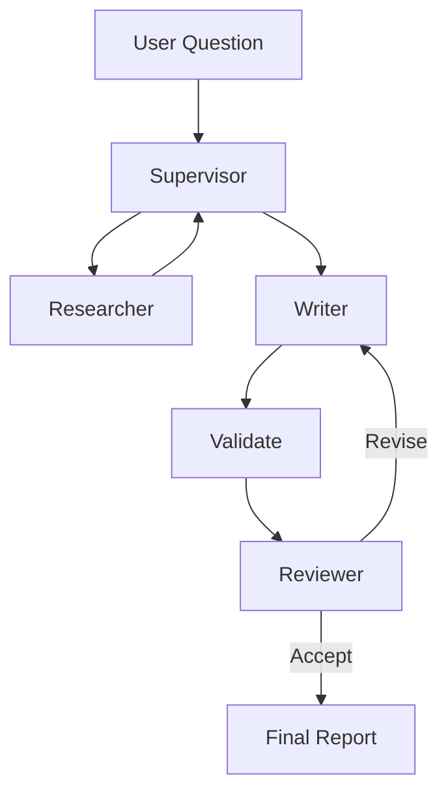

# 🧠 Multi-Agent Research Assistant

A simple **multi-agent AI system** that takes a research question, searches the web, writes a report, and reviews the result.

I built this project to learn how **LangGraph and multi-agent systems** work.

The project uses different agents for different tasks:

* 🔍 **Researcher** — searches the web and collects information
* ✍️ **Writer** — creates the research report
* 🧐 **Reviewer** — checks the report and suggests improvements
* 🎯 **Supervisor** — manages the workflow

---

## ✨ Features

* Multi-agent workflow using LangGraph
* Web search using DuckDuckGo
* Automatic research report generation
* Report review and revision
* Source citations
* Basic citation validation
* Optional human review
* Streaming agent progress
* Support for Groq, Gemini, OpenAI, and Anthropic
* LangSmith support

---

## 🏗️ How It Works

```text
User Question
      ↓
  Supervisor
      ↓
  Researcher
      ↓
  Web Search
      ↓
    Writer
      ↓
    Review
   ↙     ↘
Revise   Accept
  ↓        ↓
Writer    Final Report
```

The **Supervisor** controls the workflow.

The **Researcher** collects information from the web.

The **Writer** creates the report using the collected sources.

The **Reviewer** checks the report. If changes are needed, the Writer improves it.

---

## 🤖 Agents

### 🎯 Supervisor

Controls which agent should work next.

### 🔍 Researcher

Searches the web and collects useful information and sources.

### ✍️ Writer

Uses the research to create a structured report with citations.

### 🧐 Reviewer

Checks the report for quality, clarity, completeness, and citations.

---

## 🧠 LangGraph Workflow

The project uses **LangGraph** to connect the agents and share information between them.



---

## 🛠️ Tech Stack

| Technology                         | Purpose            |
| ---------------------------------- | ------------------ |
| Python                             | Main language      |
| LangGraph                          | Agent workflow     |
| LangChain                          | LLM integration    |
| Gemini / Groq / OpenAI / Anthropic | LLMs               |
| DuckDuckGo                         | Web search         |
| Pydantic                           | Data validation    |
| LangSmith                          | Monitoring         |
| uv                                 | Package management |

---

## 🚀 Getting Started

### 1. Clone the repository

```bash
git clone https://github.com/YOUR_USERNAME/multi-agent-research-assistant.git
cd multi-agent-research-assistant
```

### 2. Install dependencies

```bash
uv sync
```

### 3. Create `.env`

Example:

```env
LLM_PROVIDER=gemini
GOOGLE_API_KEY=your_api_key
```

### 4. Run the project

```bash
uv run python main.py "What are the latest developments in AI?"
```

For more details:

```bash
uv run python main.py --verbose "What are AI agents?"
```

---

## 📁 Project Structure

```text
multi-agent-research-assistant/
│
├── agents/
│   ├── config.py
│   ├── graph.py
│   └── tools.py
│
├── main.py
├── pyproject.toml
├── Dockerfile
├── .env-template
└── README.md
```

---

## 🎯 Why I Built This

I built this project to understand how multiple AI agents can work together instead of using a single AI model for everything.

Through this project, I learned about:

* LangGraph
* Multi-agent systems
* Agent routing
* Tool calling
* Web research
* Structured outputs
* Human-in-the-loop
* LLM workflows

---

## 🔮 Future Improvements

* Better web search
* Parallel research agents
* Better citation checking
* PDF report generation
* Frontend interface
* Conversation history
* More advanced evaluation

---

## 👤 Author

**Saugat Pudasaini**

IT Undergraduate | AI/ML & Generative AI Enthusiast

Currently learning:

**Python • Machine Learning • GenAI • RAG • AI Agents • LangChain • LangGraph • React • FastAPI**
